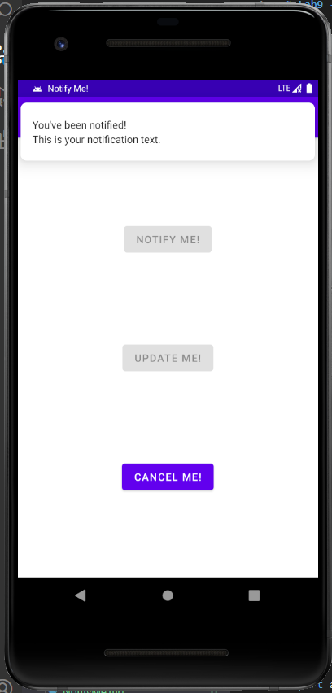

# Lab10 - NotifyMe
- [Lab10 - NotifyMe](#lab10---notifyme)
  - [Screenshot](#screenshot)
    - [Program ScreenShot](#program-screenshot)
    - [Layout ScreenShot](#layout-screenshot)
    - [Runtime ScreenShot](#runtime-screenshot)
  - [Video](#video)
  - [Code](#code)
    - [MainActivity.java](#mainactivityjava)
    - [activity_main.xml](#activity_mainxml)
    - [string.xml](#stringxml)
    - [color.xml](#colorxml)
## Screenshot
### Program ScreenShot
- 

### Layout ScreenShot 

- 


### Runtime ScreenShot
- 

- 

- 

- 

 

## Video
[视频链接](../../assets/Lab10/lab10.mp4)

## Code
### MainActivity.java
```java
package com.example.notifyme;

import androidx.appcompat.app.AppCompatActivity;
import androidx.core.app.NotificationCompat;

import android.app.NotificationChannel;
import android.app.NotificationManager;
import android.app.PendingIntent;
import android.content.BroadcastReceiver;
import android.content.Context;
import android.content.Intent;
import android.content.IntentFilter;
import android.graphics.Bitmap;
import android.graphics.BitmapFactory;
import android.graphics.Color;
import android.os.Bundle;
import android.view.View;
import android.widget.Button;

public class MainActivity extends AppCompatActivity {
    private Button button_notify;
    private Button button_cancel;
    private Button button_update;
    private static final String PRIMARY_CHANNEL_ID = "primary_notification_channel";
    private static final String ACTION_UPDATE_NOTIFICATION =
            "com.example.android.notifyme.ACTION_UPDATE_NOTIFICATION";
    private NotificationManager mNotifyManager;
    private static final int NOTIFICATION_ID = 0;
    private NotificationReceiver mReceiver = new NotificationReceiver();

    @Override
    protected void onCreate(Bundle savedInstanceState) {
        super.onCreate(savedInstanceState);
        setContentView(R.layout.activity_main);

        button_notify = findViewById(R.id.notify);
        button_notify.setOnClickListener(new View.OnClickListener() {
            @Override
            public void onClick(View view) {
                sendNotification();
            }
        });
        button_update = findViewById(R.id.update);
        button_update.setOnClickListener(new View.OnClickListener() {
            @Override
            public void onClick(View view) {
                //Update the notification
                updateNotification();
            }
        });
        button_cancel = findViewById(R.id.cancel);
        button_cancel.setOnClickListener(new View.OnClickListener() {
            @Override
            public void onClick(View view) {
                //Cancel the notification
                cancelNotification();
            }
        });
        createNotificationChannel();
        registerReceiver(mReceiver,new IntentFilter(ACTION_UPDATE_NOTIFICATION));
        setNotificationButtonState(true, false, false);
    }

    @Override
    protected void onDestroy() {
        unregisterReceiver(mReceiver);
        super.onDestroy();
    }

    public void sendNotification() {
        Intent updateIntent = new Intent(ACTION_UPDATE_NOTIFICATION);
        PendingIntent updatePendingIntent = PendingIntent.getBroadcast
                (this, NOTIFICATION_ID, updateIntent, PendingIntent.FLAG_ONE_SHOT);
        NotificationCompat.Builder notifyBuilder = getNotificationBuilder();
        notifyBuilder.addAction(R.drawable.ic_update, "Update Notification", updatePendingIntent);
        mNotifyManager.notify(NOTIFICATION_ID, notifyBuilder.build());
        setNotificationButtonState(false, true, true);
    }

    public void updateNotification() {
//        Bitmap androidImage = BitmapFactory
//                .decodeResource(getResources(),R.drawable.mascot_1);
        NotificationCompat.Builder notifyBuilder = getNotificationBuilder();
        notifyBuilder.setStyle(new NotificationCompat.InboxStyle()
                .addLine("Here is the first one")
                .addLine("This is the second one")
                .addLine("Yay last one")
                .setBigContentTitle("Title")
                .setSummaryText("+1 more"));
        mNotifyManager.notify(NOTIFICATION_ID, notifyBuilder.build());
        setNotificationButtonState(false, false, true);
    }

    public void cancelNotification() {
        mNotifyManager.cancel(NOTIFICATION_ID);
        setNotificationButtonState(true, true, false);
    }

    public void createNotificationChannel()
    {
        mNotifyManager = (NotificationManager)
                getSystemService(NOTIFICATION_SERVICE);
        if (android.os.Build.VERSION.SDK_INT >=
                android.os.Build.VERSION_CODES.O) {
            // Create a NotificationChannel
            NotificationChannel notificationChannel = new NotificationChannel(PRIMARY_CHANNEL_ID,
                    "Mascot Notification", NotificationManager
                    .IMPORTANCE_HIGH);
            notificationChannel.enableLights(true);
            notificationChannel.setLightColor(Color.RED);
            notificationChannel.enableVibration(true);
            notificationChannel.setDescription("Notification from Mascot");
            mNotifyManager.createNotificationChannel(notificationChannel);
        }
    }

    private NotificationCompat.Builder getNotificationBuilder(){
        Intent notificationIntent = new Intent(this, MainActivity.class);
        PendingIntent notificationPendingIntent = PendingIntent.getActivity(this,
                NOTIFICATION_ID, notificationIntent, PendingIntent.FLAG_UPDATE_CURRENT);
        NotificationCompat.Builder notifyBuilder = new NotificationCompat.Builder(this, PRIMARY_CHANNEL_ID)
                .setContentTitle("You've been notified!")
                .setContentText("This is your notification text.")
                .setSmallIcon(R.drawable.ic_android)
                .setContentIntent(notificationPendingIntent)
                .setAutoCancel(true)
                .setPriority(NotificationCompat.PRIORITY_HIGH)
                .setDefaults(NotificationCompat.DEFAULT_ALL);
        return notifyBuilder;
    }

    void setNotificationButtonState(Boolean isNotifyEnabled,
                                    Boolean isUpdateEnabled,
                                    Boolean isCancelEnabled) {
        button_notify.setEnabled(isNotifyEnabled);
        button_update.setEnabled(isUpdateEnabled);
        button_cancel.setEnabled(isCancelEnabled);
    }

    public class NotificationReceiver extends BroadcastReceiver {

        public NotificationReceiver() {
        }

        @Override
        public void onReceive(Context context, Intent intent) {
            // Update the notification
            updateNotification();
        }
    }
}
```


### activity_main.xml
```xml
<?xml version="1.0" encoding="utf-8"?>
<androidx.constraintlayout.widget.ConstraintLayout xmlns:android="http://schemas.android.com/apk/res/android"
    xmlns:app="http://schemas.android.com/apk/res-auto"
    xmlns:tools="http://schemas.android.com/tools"
    android:layout_width="match_parent"
    android:layout_height="match_parent"
    tools:context=".MainActivity">

    <Button
        android:id="@+id/notify"
        android:layout_width="wrap_content"
        android:layout_height="wrap_content"
        android:text="@string/notify_me"
        app:layout_constraintBottom_toTopOf="@+id/update"
        app:layout_constraintEnd_toEndOf="parent"
        app:layout_constraintStart_toStartOf="parent"
        app:layout_constraintTop_toTopOf="parent" />

    <Button
        android:id="@+id/update"
        android:layout_width="wrap_content"
        android:layout_height="wrap_content"
        android:text="@string/update_me"
        app:layout_constraintBottom_toTopOf="@+id/cancel"
        app:layout_constraintEnd_toEndOf="parent"
        app:layout_constraintStart_toStartOf="parent"
        app:layout_constraintTop_toBottomOf="@+id/notify" />

    <Button
        android:id="@+id/cancel"
        android:layout_width="wrap_content"
        android:layout_height="wrap_content"
        android:text="@string/cancel_me"
        app:layout_constraintBottom_toBottomOf="parent"
        app:layout_constraintEnd_toEndOf="parent"
        app:layout_constraintStart_toStartOf="parent"
        app:layout_constraintTop_toBottomOf="@+id/update" />

</androidx.constraintlayout.widget.ConstraintLayout>
```

### string.xml
```xml
<resources>
    <string name="app_name">Notify Me!</string>
    <string name="update_me">Update Me!</string>
    <string name="notify_me">Notify Me!</string>
    <string name="cancel_me">Cancel Me!</string>
</resources>
```

### color.xml
```xml
<?xml version="1.0" encoding="utf-8"?>
<resources>
    <color name="purple_200">#FFBB86FC</color>
    <color name="purple_500">#FF6200EE</color>
    <color name="purple_700">#FF3700B3</color>
    <color name="teal_200">#FF03DAC5</color>
    <color name="teal_700">#FF018786</color>
    <color name="black">#FF000000</color>
    <color name="white">#FFFFFFFF</color>
</resources>
```