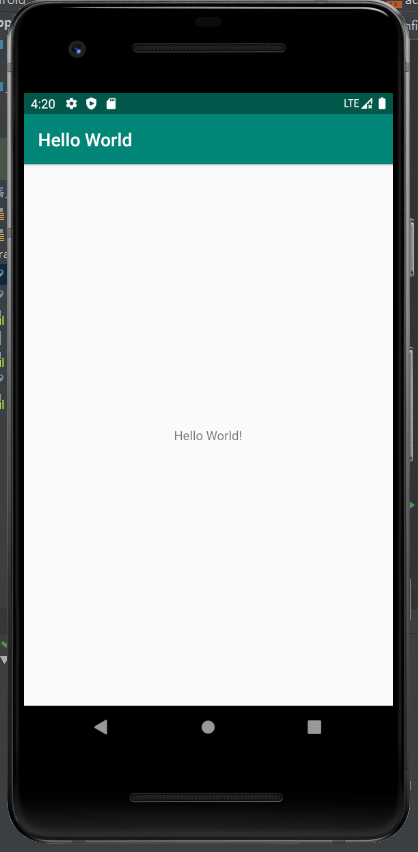
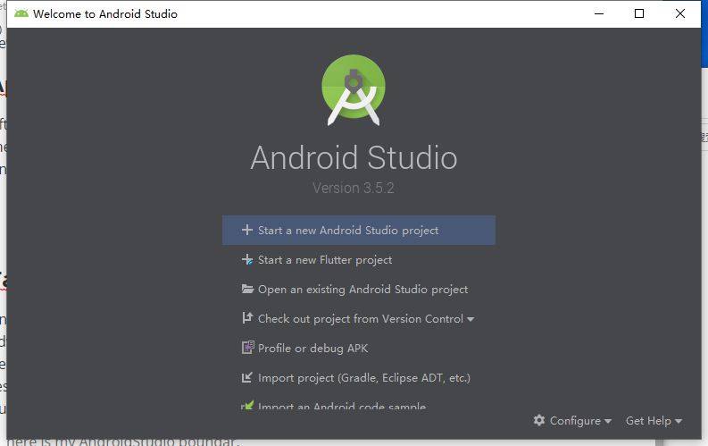
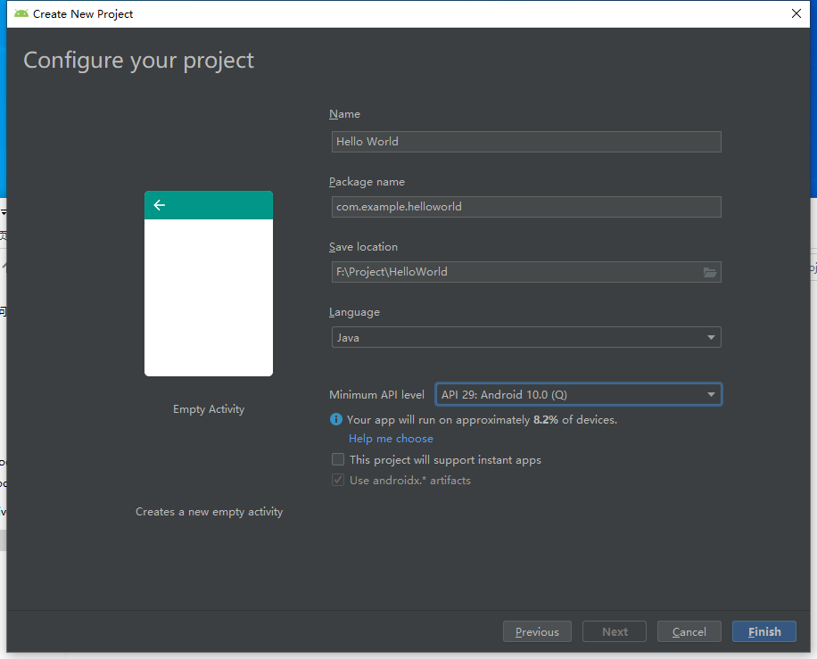
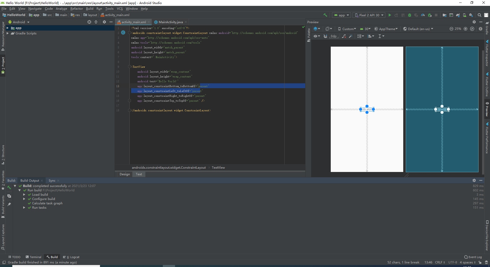
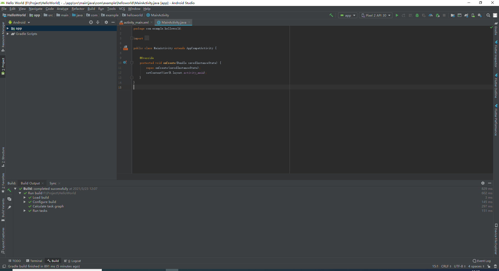
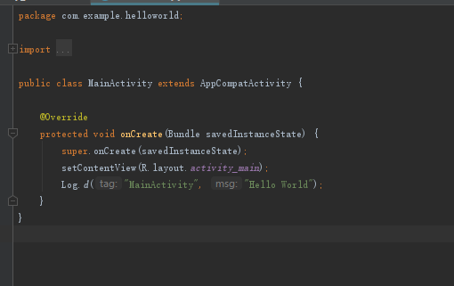
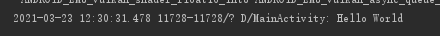
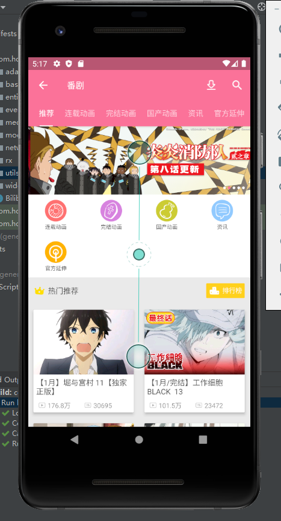

# GetStarted

> my first AndroidStudio project - Hello World !

- [GetStarted](#getstarted)
  - [Create my first Android project - Hello World](#create-my-first-android-project---hello-world)
    - [1. Welcome](#1-welcome)
    - [2. App overview](#2-app-overview)
    - [3. Task1 - Install Android Studio](#3-task1---install-android-studio)
    - [4. Task2 - Create the Hello World App](#4-task2---create-the-hello-world-app)
    - [5.Task 3 -  Use a virtual device (emulator)](#5task-3----use-a-virtual-device-emulator)
    - [6.Task4 - Add log statements to your app](#6task4---add-log-statements-to-your-app)
  - [A test for other project - An unofficial bilibili client for android](#a-test-for-other-project---an-unofficial-bilibili-client-for-android)

## Create my first Android project - Hello World

### 1. Welcome

In this practical you learn how to install Android Studio, the Android development environment. You also create and run your first Android app, Hello World, on an emulator and on a physical device.

### 2. App overview

After you successfully install Android Studio, you will create, from a template, a new project for the Hello World app. This simple app displays the string "Hello World" on the screen of the Android virtual or physical device.

> like this
>
> 

### 3. Task1 - Install Android Studio

Android Studio provides a complete integrated development environment (IDE) including an advanced code editor and a set of app templates. In addition, it contains tools for development, debugging, testing, and performance that make it faster and easier to develop apps. You can test your apps with a large range of preconfigured emulators or on your own mobile device, build production apps, and publish on the Google Play store.

> here is my AndroidStudio boundar.

### 4. Task2 - Create the Hello World App

- create my first app - hello world

- Click the **activity_main.xml** tab to see the layout editor.

- Click the **MainActivity.java** tab to see the code editor as shown below.

### 5.Task 3 -  Use a virtual device (emulator)

### 6.Task4 - Add log statements to your app

## A test for other project - An unofficial bilibili client for android

