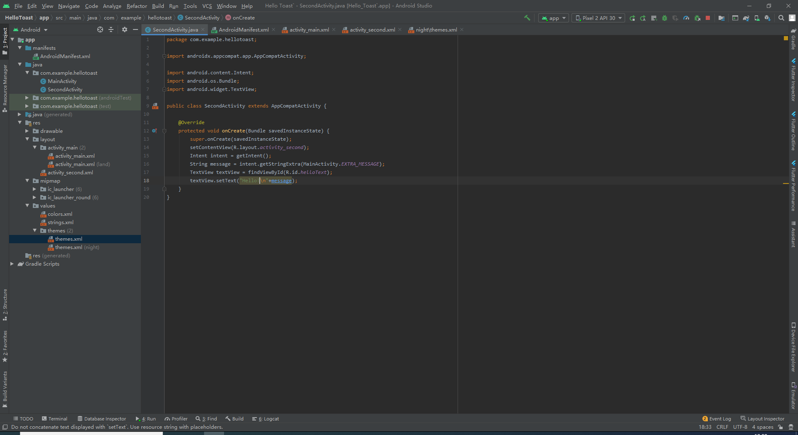
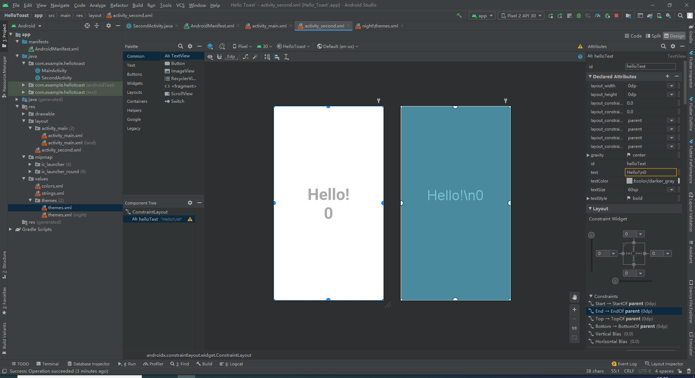
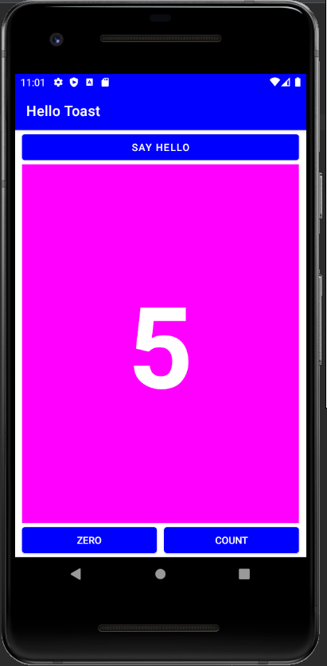
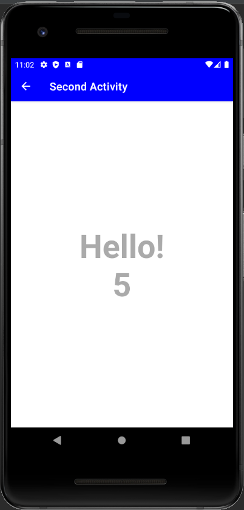

# Lab4-Say Hello
> a test project for layout 

- [Lab4-Say Hello](#lab4-say-hello)
  - [Screenshot](#screenshot)
    - [Program ScreenShot](#program-screenshot)
    - [Layout ScreenShot](#layout-screenshot)
    - [Runtime ScreenShot](#runtime-screenshot)
  - [Video](#video)
  - [Code](#code)
    - [MainActivity.java](#mainactivityjava)
    - [SecondActivity.java](#secondactivityjava)
    - [activity_second.xml](#activity_secondxml)
    - [string.xml](#stringxml)
## Screenshot
### Program ScreenShot
- 
### Layout ScreenShot

- 
### Runtime ScreenShot
- 

- 
  

## Video
[视频链接](../../assets/Lab4/lab4.mp4)

## Code
### MainActivity.java
```java
package com.example.hellotoast;

import androidx.appcompat.app.AppCompatActivity;

import android.content.Intent;
import android.graphics.Color;
import android.os.Bundle;
import android.util.Log;
import android.view.View;
import android.widget.Button;
import android.widget.TextView;

public class MainActivity extends AppCompatActivity {

    public static final String EXTRA_MESSAGE =
            "com.example.hellotoast.extra.MESSAGE";
    private static final String LOG_TAG = MainActivity.class.getSimpleName();
    private int mCount = 0;
    private TextView mShowCount;
    private Button zero;


    @Override
    protected void onCreate(Bundle savedInstanceState) {
        super.onCreate(savedInstanceState);
        if (null != savedInstanceState) {
            int intType = savedInstanceState.getInt("intType");
        }
        setContentView(R.layout.activity_main);
        mShowCount = (TextView) findViewById(R.id.show_count);
        zero = (Button) findViewById(R.id.zero);
    }


    @Override
    protected void onRestoreInstanceState(Bundle savedInstanceState) {
        super.onRestoreInstanceState(savedInstanceState);
        // 取出保存的count数据
        int intType = savedInstanceState.getInt("intType");
        mCount = intType;
        // 重新调整颜色以及数据
        zero.setBackgroundColor(Color.BLUE);
        if (mShowCount != null)
            if(mCount % 2 != 0) {
                mShowCount.setBackgroundColor(Color.MAGENTA );
                mShowCount.setTextColor(Color.WHITE);
            }
            else {
                mShowCount.setBackgroundColor(Color.YELLOW);
                mShowCount.setTextColor(Color.BLUE);
            }
        mShowCount.setText(Integer.toString(mCount));
    }

    @Override
    protected void onSaveInstanceState(Bundle outState) {
        super.onSaveInstanceState(outState);
        // 保存count数据
        outState.putInt("intType", mCount);
    }

    public void launchSecondActivity(View view) {
        Intent intent = new Intent(this, SecondActivity.class);
        String message = mShowCount.getText().toString();
        intent.putExtra(EXTRA_MESSAGE, message);
        Log.d(LOG_TAG, "Button clicked!");
        startActivity(intent);
    }

    public void countUp(View view) {
        ++mCount;
        zero.setBackgroundColor(Color.BLUE);
        if (mShowCount != null)
            if(mCount % 2 != 0) {
                mShowCount.setBackgroundColor(Color.MAGENTA );
                mShowCount.setTextColor(Color.WHITE);
            }
            else {
                mShowCount.setBackgroundColor(Color.YELLOW);
                mShowCount.setTextColor(Color.BLUE);
            }
            mShowCount.setText(Integer.toString(mCount));
    }

    public void countZero(View view) {
        mCount = 0;
        zero.setBackgroundColor(Color.GRAY);
        mShowCount.setBackgroundColor(Color.YELLOW);
        mShowCount.setTextColor(Color.BLUE);
        if (mShowCount != null)
            mShowCount.setText(Integer.toString(mCount));
    }

}
```


### SecondActivity.java
```java
package com.example.hellotoast;

import androidx.appcompat.app.AppCompatActivity;

import android.content.Intent;
import android.os.Bundle;

import android.view.MenuItem;
import android.widget.TextView;

public class SecondActivity extends AppCompatActivity {

    @Override
    protected void onCreate(Bundle savedInstanceState) {
        super.onCreate(savedInstanceState);
        setContentView(R.layout.activity_second);
        Intent intent = getIntent();
        String message = intent.getStringExtra(MainActivity.EXTRA_MESSAGE);
        TextView textView = findViewById(R.id.helloText);
        textView.setText("Hello!\n"+message);
    }

    @Override
    public boolean onOptionsItemSelected(MenuItem item) {
        switch (item.getItemId()) {
            case android.R.id.home:
                finish();
                return true;
        }
        return super.onOptionsItemSelected(item);
    }
}
```

### activity_second.xml
```xml
<?xml version="1.0" encoding="utf-8"?>
<androidx.constraintlayout.widget.ConstraintLayout xmlns:android="http://schemas.android.com/apk/res/android"
    xmlns:app="http://schemas.android.com/apk/res-auto"
    xmlns:tools="http://schemas.android.com/tools"
    android:layout_width="match_parent"
    android:layout_height="match_parent"
    android:id="@+id/toolbar"
    tools:context=".SecondActivity">

    <TextView
        android:id="@+id/helloText"
        android:layout_width="0dp"
        android:layout_height="0dp"
        android:gravity="center"
        android:text="Hello!\n0"
        android:textAlignment="center"
        android:textColor="@android:color/darker_gray"
        android:textSize="60sp"
        android:textStyle="bold"
        app:layout_constraintBottom_toBottomOf="parent"
        app:layout_constraintEnd_toEndOf="parent"
        app:layout_constraintHorizontal_bias="0.0"
        app:layout_constraintStart_toStartOf="parent"
        app:layout_constraintTop_toTopOf="parent"
        app:layout_constraintVertical_bias="0.0" />
    
</androidx.constraintlayout.widget.ConstraintLayout>
```

```xml
<?xml version="1.0" encoding="utf-8"?>
<androidx.constraintlayout.widget.ConstraintLayout xmlns:android="http://schemas.android.com/apk/res/android"
    xmlns:app="http://schemas.android.com/apk/res-auto"
    xmlns:tools="http://schemas.android.com/tools"
    android:id="@+id/Toast"
    android:layout_width="match_parent"
    android:layout_height="match_parent"
    tools:context=".MainActivity">

    <Button
        android:id="@+id/zero"
        style="@style/Widget.AppCompat.Button"
        android:layout_width="wrap_content"
        android:layout_height="44dp"
        android:layout_marginTop="70dp"
        android:background="#888888"
        android:onClick="countZero"
        android:text="@string/zero"
        android:textColor="@color/white"
        app:backgroundTint="#888888"
        app:layout_constraintStart_toStartOf="@+id/toast"
        app:layout_constraintTop_toBottomOf="@+id/toast" />

    <Button
        android:id="@+id/Count"
        style="@style/Widget.AppCompat.Button"
        android:layout_width="wrap_content"
        android:layout_height="wrap_content"
        android:layout_marginTop="70dp"
        android:background="#1736E1"
        android:onClick="countUp"
        android:text="@string/count"
        android:textColor="@color/white"
        app:backgroundTint="#1736E1"
        app:layout_constraintStart_toStartOf="@+id/zero"
        app:layout_constraintTop_toBottomOf="@+id/zero" />

    <TextView
        android:id="@+id/show_count"
        android:layout_width="0dp"
        android:layout_height="0dp"
        android:layout_marginStart="10dp"
        android:layout_marginLeft="10dp"
        android:layout_marginTop="10dp"
        android:layout_marginEnd="10dp"
        android:layout_marginRight="10dp"
        android:layout_marginBottom="10dp"
        android:background="#FFFF00"
        android:gravity="center"
        android:text="@string/show_count"
        android:textAlignment="center"
        android:textAllCaps="true"
        android:textColor="#3F51B5"
        android:textIsSelectable="false"
        android:textSize="160sp"
        android:textStyle="bold"
        app:layout_constraintBottom_toBottomOf="parent"
        app:layout_constraintEnd_toEndOf="parent"
        app:layout_constraintStart_toEndOf="@+id/Count"
        app:layout_constraintTop_toTopOf="parent" />

    <Button
        android:id="@+id/toast"
        android:layout_width="wrap_content"
        android:layout_height="wrap_content"
        android:layout_marginStart="10dp"
        android:layout_marginLeft="10dp"
        android:layout_marginTop="10dp"
        android:background="#1736E1"
        android:onClick="showToast"
        android:text="@string/toast"
        app:backgroundTint="#1736E1"
        app:layout_constraintStart_toStartOf="parent"
        app:layout_constraintTop_toTopOf="parent" />

</androidx.constraintlayout.widget.ConstraintLayout>
```


```xml
<?xml version="1.0" encoding="utf-8"?>
<resources>
    <color name="purple_200">#FFBB86FC</color>
    <color name="purple_500">#FF6200EE</color>
    <color name="purple_700">#FF3700B3</color>
    <color name="teal_200">#FF03DAC5</color>
    <color name="teal_700">#FF018786</color>
    <color name="black">#FF000000</color>
    <color name="white">#FFFFFFFF</color>
    <color name="blue">#FF0000FF</color>
</resources>
```

### string.xml
```xml
<resources>
    <string name="app_name">Hello Toast</string>
    <string name="count">COUNT</string>
    <string name="show_count">0</string>
    <string name="toast_message">Hello Toast!</string>
    <string name="zero">ZERO</string>
    <string name="say_hello">Say Hello</string>
</resources>
```