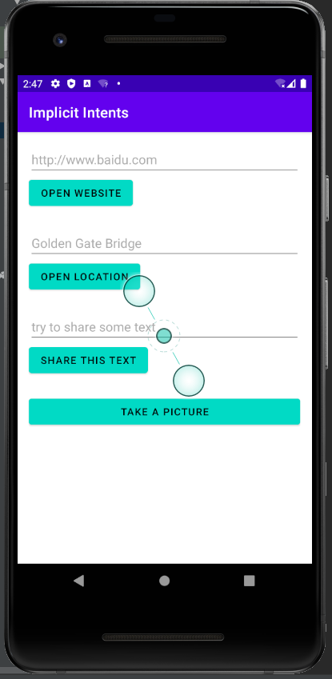

# Lab5-Implicit Intents
> learn how to create an implicit Intent, and use its actions and categories.

- [Lab5-Implicit Intents](#lab5-implicit-intents)
  - [Screenshot](#screenshot)
    - [Program ScreenShot](#program-screenshot)
    - [Layout ScreenShot](#layout-screenshot)
    - [Runtime ScreenShot](#runtime-screenshot)
  - [Video](#video)
  - [Code](#code)
    - [MainActivity.java](#mainactivityjava)
    - [activity_main.xml](#activity_mainxml)
    - [string.xml](#stringxml)
## Screenshot
### Program ScreenShot
- 

### Layout ScreenShot

- 

### Runtime ScreenShot
- 

- 

- 

- 

- 
  

## Video
[视频链接](../../assets/Lab5/lab5.mp4)

## Code
### MainActivity.java
```java
package com.example.implicitintents;

import androidx.appcompat.app.AppCompatActivity;
import androidx.core.app.ShareCompat;

import android.content.Intent;
import android.net.Uri;
import android.os.Bundle;
import android.provider.MediaStore;
import android.util.Log;
import android.view.View;
import android.widget.Button;
import android.widget.EditText;

public class MainActivity extends AppCompatActivity {
    private static final int REQUEST_CODE_TAKE_PICTURE = 0x00000012;
    ;
    private EditText mWebsiteEditText;
    private EditText mLocationEditText;
    private EditText mShareTextEditText;
    private Button mCameraButton;

    @Override
    protected void onCreate(Bundle savedInstanceState) {
        super.onCreate(savedInstanceState);
        setContentView(R.layout.activity_main);
        mWebsiteEditText = findViewById(R.id.website_edittext);
        mLocationEditText = findViewById(R.id.location_edittext);
        mShareTextEditText = findViewById(R.id.share_edittext);
        mCameraButton = findViewById(R.id.picture_button);
    }

    public void openWebsite(View view) {
        String url = mWebsiteEditText.getText().toString();
        Uri webPage = Uri.parse(url);
        Intent intent = new Intent(Intent.ACTION_VIEW, webPage);

        //Android 11 后intent.resolveActivity(getPackageManager())均返回null，不能再用来检测应用是否正常工作
      //  if (intent.resolveActivity(getPackageManager()) != null) {
            startActivity(intent);
       // } else {
        //    Log.d("ImplicitIntents", "Can't handle this intent!");
        //}
    }

    public void openLocation(View view) {
            String loc = mLocationEditText.getText().toString();

            Uri addressUri = Uri.parse("geo:0,0?q=" + loc);
            Intent intent = new Intent(Intent.ACTION_VIEW, addressUri);

           // if (intent.resolveActivity(getPackageManager()) != null) {
                startActivity(intent);
          //  } else {
          //      Log.e("ImplicitIntents", "Can't handle this intent!");
         //   }
    }

    public void shareText(View view) {
        String txt = mShareTextEditText.getText().toString();
        String mimeType = "text/plain";

        ShareCompat.IntentBuilder
                .from(this)
                .setType(mimeType)
                .setChooserTitle(R.string.share_text_with)
                .setText(txt)
                .startChooser();
    }

    public void takePicture(View view) {
        Intent intent = new Intent(MediaStore.ACTION_IMAGE_CAPTURE);
        startActivityForResult(intent, REQUEST_CODE_TAKE_PICTURE);

    }
}
```


### activity_main.xml
```xml
<LinearLayout xmlns:android="http://schemas.android.com/apk/res/android"
    xmlns:app="http://schemas.android.com/apk/res-auto"
    xmlns:tools="http://schemas.android.com/tools"
    android:layout_width="match_parent"
    android:layout_height="match_parent"
    android:orientation="vertical"
    android:padding="16dp"
    tools:context="com.example.implicitintents.MainActivity">

    <EditText
        android:id="@+id/website_edittext"
        android:layout_width="match_parent"
        android:layout_height="wrap_content"
        android:text="@string/edittext_uri"
        android:textColor="@android:color/darker_gray" />

    <Button
        android:id="@+id/open_website_button"
        android:layout_width="wrap_content"
        android:layout_height="wrap_content"
        android:layout_marginBottom="24dp"
        android:onClick="openWebsite"
        android:text="@string/button_uri"
        android:textColor="#000000"
        app:backgroundTint="?attr/colorControlActivated" />

    <EditText
        android:id="@+id/location_edittext"
        android:layout_width="match_parent"
        android:layout_height="wrap_content"
        android:text="@string/edittext_loc"
        android:textColor="@android:color/darker_gray" />

    <Button
        android:id="@+id/open_location_button"
        android:layout_width="wrap_content"
        android:layout_height="wrap_content"
        android:layout_marginBottom="24dp"
        android:onClick="openLocation"
        android:text="@string/button_loc"
        android:textColor="#000000"
        app:backgroundTint="?attr/colorControlActivated" />

    <EditText
        android:id="@+id/share_edittext"
        android:layout_width="match_parent"
        android:layout_height="wrap_content"
        android:text="@string/edittext_share"
        android:textColor="@android:color/darker_gray" />

    <Button
        android:id="@+id/share_text_button"
        android:layout_width="wrap_content"
        android:layout_height="wrap_content"
        android:layout_marginBottom="24dp"
        android:onClick="shareText"
        android:text="@string/button_share"
        android:textColor="#000000"
        app:backgroundTint="?attr/colorControlActivated" />

    <Button
        android:id="@+id/picture_button"
        android:layout_width="match_parent"
        android:layout_height="wrap_content"
        android:onClick="takePicture"
        android:text="Take a picture"
        android:textColor="#000000"
        app:backgroundTint="?attr/colorControlActivated" />

</LinearLayout>
```

### string.xml
```xml
<resources>
    <string name="app_name">Implicit Intents</string>
    <string name="edittext_uri">http://www.baidu.com</string>
    <string name="button_uri">Open Website</string>

    <string name="edittext_loc">Golden Gate Bridge</string>
    <string name="button_loc">Open Location</string>

    <string name="edittext_share">try to share some text</string>
    <string name="button_share">Share This Text</string>
    <string name="share_text_with">"Share this text with: "</string>
</resources>
```