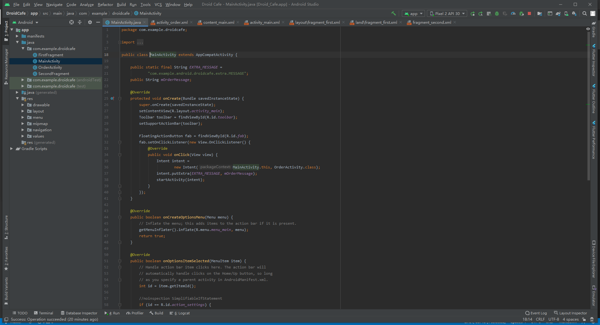
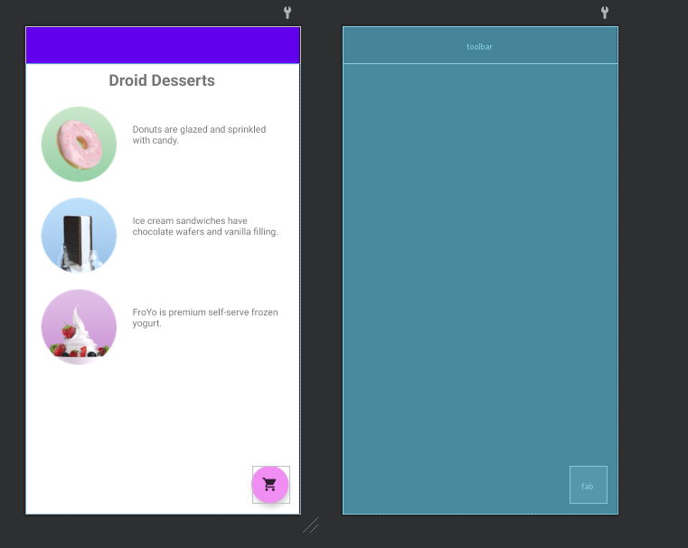
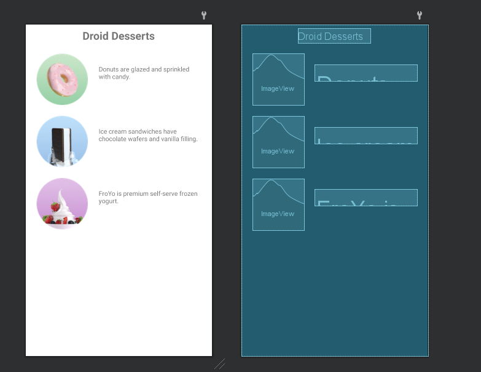
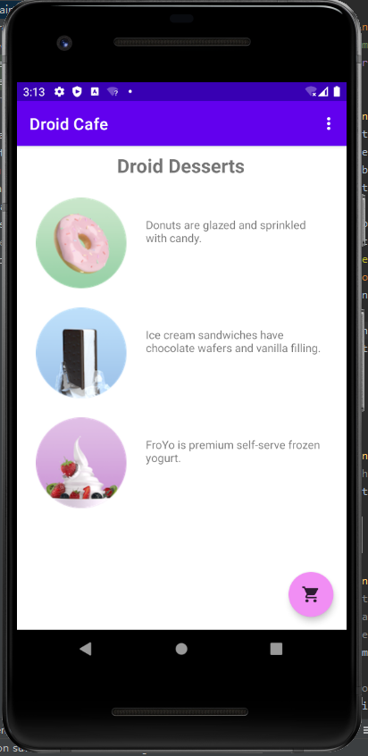
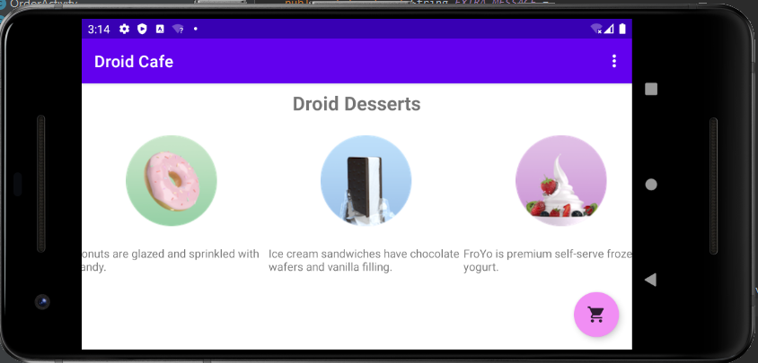
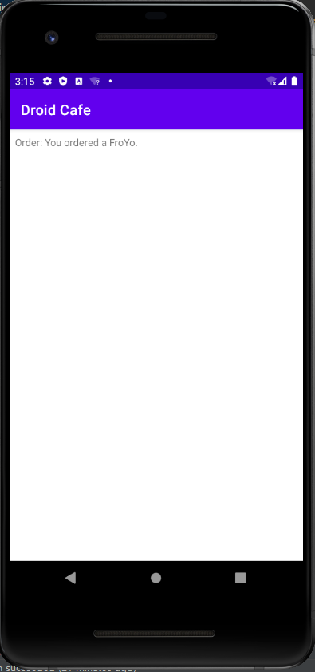

# Lab6-Droid Cafe

- [Lab6-Droid Cafe](#lab6-droid-cafe)
  - [Screenshot](#screenshot)
    - [Program ScreenShot](#program-screenshot)
    - [Layout ScreenShot](#layout-screenshot)
    - [Runtime ScreenShot](#runtime-screenshot)
  - [Video](#video)
  - [Code](#code)
    - [MainActivity.java](#mainactivityjava)
    - [OrderActivity.java](#orderactivityjava)
    - [activity_main.xml](#activity_mainxml)
    - [fragment_first.xml](#fragment_firstxml)
    - [fragment_first(land).xml](#fragment_firstlandxml)
    - [activity_order.xml](#activity_orderxml)
    - [string.xml](#stringxml)
## Screenshot
### Program ScreenShot
- 

### Layout ScreenShot

- 

- 

- .png)

- 

### Runtime ScreenShot
- 

- 

- 

  

## Video
[视频链接](../../assets/Lab6/lab6.mp4)

## Code
### MainActivity.java
```java
package com.example.droidcafe;

import android.content.Intent;
import android.os.Bundle;

import com.google.android.material.floatingactionbutton.FloatingActionButton;
import com.google.android.material.snackbar.Snackbar;

import androidx.appcompat.app.AppCompatActivity;
import androidx.appcompat.widget.Toolbar;

import android.view.View;

import android.view.Menu;
import android.view.MenuItem;
import android.widget.Toast;

public class MainActivity extends AppCompatActivity {

    public static final String EXTRA_MESSAGE =
            "com.example.android.droidcafe.extra.MESSAGE";
    public String mOrderMessage;

    @Override
    protected void onCreate(Bundle savedInstanceState) {
        super.onCreate(savedInstanceState);
        setContentView(R.layout.activity_main);
        Toolbar toolbar = findViewById(R.id.toolbar);
        setSupportActionBar(toolbar);

        FloatingActionButton fab = findViewById(R.id.fab);
        fab.setOnClickListener(new View.OnClickListener() {
            @Override
            public void onClick(View view) {
                Intent intent =
                        new Intent(MainActivity.this, OrderActivity.class);
                intent.putExtra(EXTRA_MESSAGE, mOrderMessage);
                startActivity(intent);
            }
        });
    }

    @Override
    public boolean onCreateOptionsMenu(Menu menu) {
        // Inflate the menu; this adds items to the action bar if it is present.
        getMenuInflater().inflate(R.menu.menu_main, menu);
        return true;
    }

    @Override
    public boolean onOptionsItemSelected(MenuItem item) {
        // Handle action bar item clicks here. The action bar will
        // automatically handle clicks on the Home/Up button, so long
        // as you specify a parent activity in AndroidManifest.xml.
        int id = item.getItemId();

        //noinspection SimplifiableIfStatement
        if (id == R.id.action_settings) {
            return true;
        }

        return super.onOptionsItemSelected(item);
    }

    public void showDonutOrder(View view) {
        mOrderMessage = getString(R.string.donut_order_message);
        displayToast(mOrderMessage);
    }

    public void displayToast(String message) {
        Toast.makeText(getApplicationContext(), message,
                Toast.LENGTH_SHORT).show();
    }


    /**
     * Shows a message that the ice cream sandwich image was clicked.
     */
    public void showIceCreamOrder(View view) {
        mOrderMessage = getString(R.string.ice_cream_order_message);
        displayToast(mOrderMessage);
    }

    /**
     * Shows a message that the froyo image was clicked.
     */
    public void showFroyoOrder(View view) {

        mOrderMessage = getString(R.string.froyo_order_message);
        displayToast(mOrderMessage);
    }
}
```

### OrderActivity.java
```java
package com.example.droidcafe;

import androidx.appcompat.app.AppCompatActivity;

import android.content.Intent;
import android.os.Bundle;
import android.widget.TextView;

public class OrderActivity extends AppCompatActivity {


    @Override
    protected void onCreate(Bundle savedInstanceState) {
        super.onCreate(savedInstanceState);
        setContentView(R.layout.activity_order);
        Intent intent = getIntent();
        String message = "Order: " +
                intent.getStringExtra(MainActivity.EXTRA_MESSAGE);
        TextView textView = findViewById(R.id.order_textview);
        textView.setText(message);
    }
}
```


### activity_main.xml
```xml
<?xml version="1.0" encoding="utf-8"?>
<androidx.coordinatorlayout.widget.CoordinatorLayout xmlns:android="http://schemas.android.com/apk/res/android"
    xmlns:app="http://schemas.android.com/apk/res-auto"
    xmlns:tools="http://schemas.android.com/tools"
    android:layout_width="match_parent"
    android:layout_height="match_parent"
    tools:context=".MainActivity">

    <com.google.android.material.appbar.AppBarLayout
        android:layout_width="match_parent"
        android:layout_height="wrap_content"
        android:theme="@style/Theme.DroidCafe.AppBarOverlay">

        <androidx.appcompat.widget.Toolbar
            android:id="@+id/toolbar"
            android:layout_width="match_parent"
            android:layout_height="?attr/actionBarSize"
            android:background="?attr/colorPrimary"
            app:popupTheme="@style/Theme.DroidCafe.PopupOverlay" />

    </com.google.android.material.appbar.AppBarLayout>

    <include layout="@layout/content_main" />

    <com.google.android.material.floatingactionbutton.FloatingActionButton
        android:id="@+id/fab"
        android:layout_width="wrap_content"
        android:layout_height="wrap_content"
        android:layout_gravity="bottom|end"
        android:layout_margin="@dimen/fab_margin"
        app:backgroundTint="#F18EF4"
        app:srcCompat="@drawable/ic_shopping_cart" />

</androidx.coordinatorlayout.widget.CoordinatorLayout>
```

### fragment_first.xml
```xml
<?xml version="1.0" encoding="utf-8"?>
<androidx.constraintlayout.widget.ConstraintLayout xmlns:android="http://schemas.android.com/apk/res/android"
    xmlns:app="http://schemas.android.com/apk/res-auto"
    xmlns:tools="http://schemas.android.com/tools"
    android:layout_width="match_parent"
    android:layout_height="match_parent"
    tools:context=".FirstFragment">

    <TextView
        android:id="@+id/textintro"
        android:layout_width="wrap_content"
        android:layout_height="wrap_content"
        android:layout_marginTop="8dp"
        android:text="@string/droid_desserts"
        android:textSize="24sp"
        android:textStyle="bold"
        app:layout_constraintEnd_toEndOf="parent"
        app:layout_constraintHorizontal_bias="0.498"
        app:layout_constraintStart_toStartOf="parent"
        app:layout_constraintTop_toTopOf="parent" />

    <ImageView
        android:id="@+id/donut"
        android:layout_width="0dp"
        android:layout_height="wrap_content"
        android:layout_marginStart="24dp"
        android:layout_marginLeft="24dp"
        android:layout_marginTop="24dp"
        android:contentDescription="@string/donuts"
        android:src="@drawable/donut_circle"
        app:layout_constraintStart_toStartOf="parent"
        app:layout_constraintTop_toBottomOf="@+id/textintro" />

    <ImageView
        android:id="@+id/froyo"
        android:layout_width="wrap_content"
        android:layout_height="wrap_content"
        android:layout_marginStart="24dp"
        android:layout_marginLeft="24dp"
        android:layout_marginTop="24dp"
        android:contentDescription="@string/froyo"
        android:src="@drawable/froyo_circle"
        app:layout_constraintStart_toStartOf="parent"
        app:layout_constraintTop_toBottomOf="@+id/ice_cream" />

    <ImageView
        android:id="@+id/ice_cream"
        android:layout_width="wrap_content"
        android:layout_height="wrap_content"
        android:layout_marginStart="24dp"
        android:layout_marginLeft="24dp"
        android:layout_marginTop="24dp"
        android:contentDescription="@string/ice_cream_sandwiches"
        android:src="@drawable/icecream_circle"
        app:layout_constraintStart_toStartOf="parent"
        app:layout_constraintTop_toBottomOf="@+id/donut" />

    <TextView
        android:id="@+id/donut_description"
        android:layout_width="0dp"
        android:layout_height="wrap_content"
        android:layout_marginStart="24dp"
        android:layout_marginLeft="24dp"
        android:layout_marginTop="24dp"
        android:layout_marginEnd="24dp"
        android:layout_marginRight="24dp"
        android:onClick="showDonutOrder"
        android:text="@string/donuts"
        app:layout_constraintEnd_toEndOf="parent"
        app:layout_constraintHorizontal_bias="0.0"
        app:layout_constraintStart_toEndOf="@+id/donut"
        app:layout_constraintTop_toTopOf="@+id/donut" />

    <TextView
        android:id="@+id/ice_cream_description"
        android:layout_width="0dp"
        android:layout_height="wrap_content"
        android:layout_marginStart="24dp"
        android:layout_marginLeft="24dp"
        android:layout_marginTop="24dp"
        android:layout_marginEnd="24dp"
        android:layout_marginRight="24dp"
        android:onClick="showIceCreamOrder"
        android:text="@string/ice_cream_sandwiches"
        app:layout_constraintEnd_toEndOf="parent"
        app:layout_constraintStart_toEndOf="@+id/ice_cream"
        app:layout_constraintTop_toTopOf="@+id/ice_cream" />

    <TextView
        android:id="@+id/froyo_description"
        android:layout_width="0dp"
        android:layout_height="wrap_content"
        android:layout_marginStart="24dp"
        android:layout_marginLeft="24dp"
        android:layout_marginTop="24dp"
        android:layout_marginEnd="24dp"
        android:layout_marginRight="24dp"
        android:onClick="showFroyoOrder"
        android:text="@string/froyo"
        app:layout_constraintEnd_toEndOf="parent"
        app:layout_constraintStart_toEndOf="@+id/froyo"
        app:layout_constraintTop_toTopOf="@+id/froyo" />
</androidx.constraintlayout.widget.ConstraintLayout>
```

### fragment_first(land).xml
```xml
<?xml version="1.0" encoding="utf-8"?>
<androidx.constraintlayout.widget.ConstraintLayout xmlns:android="http://schemas.android.com/apk/res/android"
    xmlns:app="http://schemas.android.com/apk/res-auto"
    xmlns:tools="http://schemas.android.com/tools"
    android:layout_width="match_parent"
    android:layout_height="match_parent"
    tools:context=".FirstFragment">

    <TextView
        android:id="@+id/textintro"
        android:layout_width="wrap_content"
        android:layout_height="wrap_content"
        android:layout_marginTop="8dp"
        android:text="@string/droid_desserts"
        android:textSize="24sp"
        android:textStyle="bold"
        app:layout_constraintEnd_toEndOf="parent"
        app:layout_constraintStart_toStartOf="parent"
        app:layout_constraintTop_toTopOf="parent" />

    <ImageView
        android:id="@+id/donut"
        android:layout_width="242dp"
        android:layout_height="wrap_content"
        android:layout_marginStart="24dp"
        android:layout_marginLeft="24dp"
        android:layout_marginTop="24dp"
        android:contentDescription="@string/donuts"
        android:src="@drawable/donut_circle"
        app:layout_constraintEnd_toStartOf="@+id/ice_cream"
        app:layout_constraintHorizontal_bias="0.5"
        app:layout_constraintStart_toStartOf="parent"
        app:layout_constraintTop_toBottomOf="@+id/textintro" />

    <ImageView
        android:id="@+id/froyo"
        android:layout_width="243dp"
        android:layout_height="wrap_content"
        android:layout_marginTop="24dp"
        android:contentDescription="@string/froyo"
        android:src="@drawable/froyo_circle"
        app:layout_constraintEnd_toEndOf="parent"
        app:layout_constraintHorizontal_bias="1.0"
        app:layout_constraintStart_toEndOf="@+id/ice_cream"
        app:layout_constraintTop_toBottomOf="@+id/textintro" />

    <ImageView
        android:id="@+id/ice_cream"
        android:layout_width="242dp"
        android:layout_height="wrap_content"
        android:layout_marginTop="24dp"
        android:contentDescription="@string/ice_cream_sandwiches"
        android:src="@drawable/icecream_circle"
        app:layout_constraintEnd_toStartOf="@+id/froyo"
        app:layout_constraintStart_toEndOf="@+id/donut"
        app:layout_constraintTop_toBottomOf="@+id/textintro" />

    <TextView
        android:id="@+id/donut_description"
        android:layout_width="0dp"
        android:layout_height="wrap_content"
        android:layout_marginTop="24dp"
        android:onClick="showDonutOrder"
        android:text="@string/donuts"
        app:layout_constraintEnd_toEndOf="@+id/donut"
        app:layout_constraintStart_toStartOf="@+id/donut"
        app:layout_constraintTop_toBottomOf="@+id/donut" />

    <TextView
        android:id="@+id/ice_cream_description"
        android:layout_width="0dp"
        android:layout_height="wrap_content"
        android:layout_marginTop="24dp"
        android:onClick="showIceCreamOrder"
        android:text="@string/ice_cream_sandwiches"
        app:layout_constraintEnd_toStartOf="@+id/froyo"
        app:layout_constraintStart_toEndOf="@+id/donut"
        app:layout_constraintTop_toBottomOf="@+id/ice_cream" />

    <TextView
        android:id="@+id/froyo_description"
        android:layout_width="0dp"
        android:layout_height="wrap_content"
        android:layout_marginTop="24dp"
        android:onClick="showFroyoOrder"
        android:text="@string/froyo"
        app:layout_constraintEnd_toEndOf="@+id/froyo"
        app:layout_constraintStart_toStartOf="@+id/froyo"
        app:layout_constraintTop_toBottomOf="@+id/froyo" />

</androidx.constraintlayout.widget.ConstraintLayout>
```

### activity_order.xml
```xml
<?xml version="1.0" encoding="utf-8"?>
<androidx.constraintlayout.widget.ConstraintLayout xmlns:android="http://schemas.android.com/apk/res/android"
    xmlns:app="http://schemas.android.com/apk/res-auto"
    xmlns:tools="http://schemas.android.com/tools"
    android:layout_width="match_parent"
    android:layout_height="match_parent"
    tools:context=".OrderActivity">

    <TextView
        android:id="@+id/order_textview"
        android:layout_width="0dp"
        android:layout_height="wrap_content"
        android:layout_marginStart="8dp"
        android:layout_marginLeft="8dp"
        android:layout_marginTop="8dp"
        android:text="TextView"
        app:layout_constraintStart_toStartOf="parent"
        app:layout_constraintTop_toTopOf="parent" />
</androidx.constraintlayout.widget.ConstraintLayout>
```

### string.xml
```xml
<resources>
    <string name="app_name">Droid Cafe</string>
    <string name="action_settings">Settings</string>
    <!-- Strings used for fragments for navigation -->
    <string name="first_fragment_label">First Fragment</string>
    <string name="second_fragment_label">Second Fragment</string>
    <string name="next">Next</string>
    <string name="previous">Previous</string>

    <string name="hello_first_fragment">Hello first fragment</string>
    <string name="hello_second_fragment">Hello second fragment. Arg: %1$s</string>
    <string name="droid_desserts">Droid Desserts</string>
    <string name="donuts">Donuts are glazed and sprinkled with candy.</string>
    <string name="ice_cream_sandwiches">Ice cream sandwiches have chocolate wafers and vanilla filling.</string>
    <string name="froyo">FroYo is premium self-serve frozen yogurt.</string>
    <string name="donut_order_message">You ordered a donut.</string>
    <string name="ice_cream_order_message">You ordered an ice cream sandwich.</string>
    <string name="froyo_order_message">You ordered a FroYo.</string>
</resources>
```