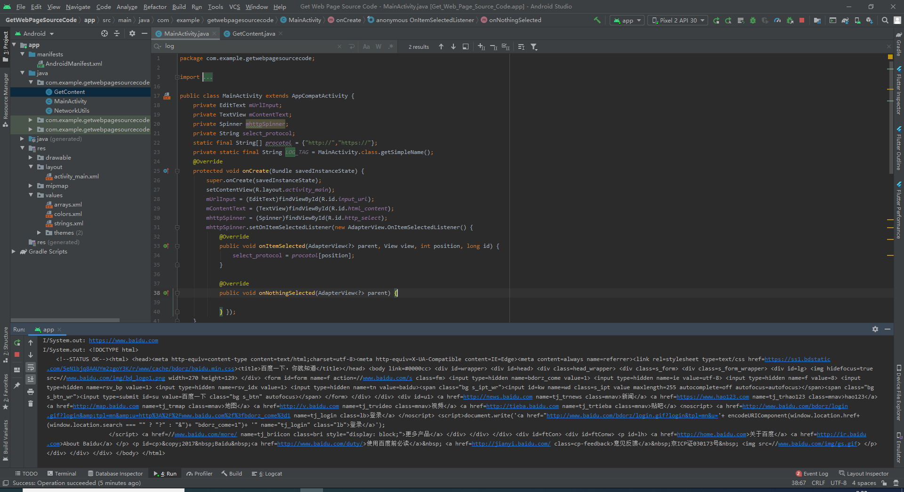
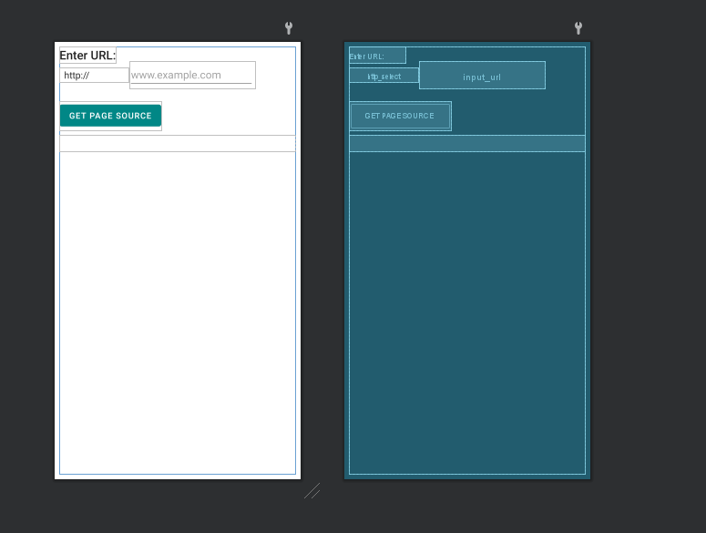
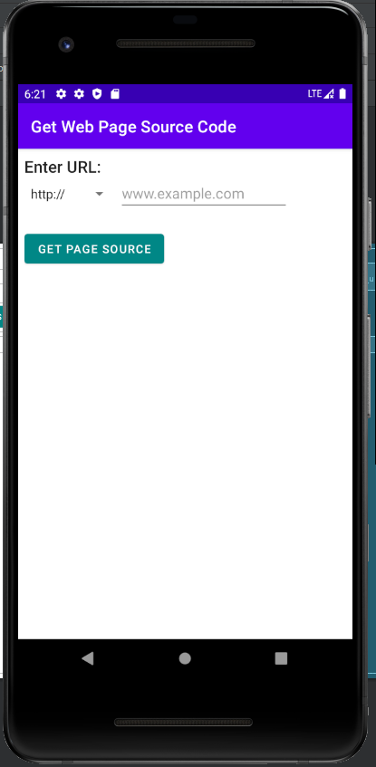
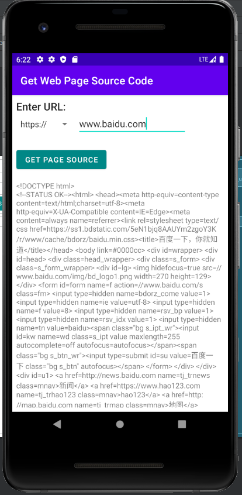

# Lab9 - Homework - Get Web Page Source Code

- [Lab9 - Homework - Get Web Page Source Code](#lab9---homework---get-web-page-source-code)
  - [Screenshot](#screenshot)
    - [Program ScreenShot](#program-screenshot)
    - [Layout ScreenShot](#layout-screenshot)
    - [Runtime ScreenShot](#runtime-screenshot)
  - [Video](#video)
  - [Code](#code)
    - [MainActivity.java](#mainactivityjava)
    - [GetContent.java](#getcontentjava)
    - [NetworkUtils.java](#networkutilsjava)
    - [activity_main.xml](#activity_mainxml)
    - [string.xml](#stringxml)
    - [color.xml](#colorxml)
    - [array.xml](#arrayxml)
## Screenshot
### Program ScreenShot
- 

### Layout ScreenShot

- 


### Runtime ScreenShot
- 

- 

 

## Video
[视频链接](../../assets/Lab9/homework/lab9_homework.mp4)

## Code
### MainActivity.java
```java
package com.example.getwebpagesourcecode;

import androidx.appcompat.app.AppCompatActivity;

import android.content.Context;
import android.net.ConnectivityManager;
import android.net.NetworkInfo;
import android.os.Bundle;
import android.util.Log;
import android.view.View;
import android.view.inputmethod.InputMethodManager;
import android.widget.AdapterView;
import android.widget.EditText;
import android.widget.Spinner;
import android.widget.TextView;

public class MainActivity extends AppCompatActivity {
    private EditText mUrlInput;
    private TextView mContentText;
    private Spinner mhttpSpinner;
    private String select_protocol;
    static final String[] procotol = {"http://","https://"};
    private static final String LOG_TAG = MainActivity.class.getSimpleName();
    @Override
    protected void onCreate(Bundle savedInstanceState) {
        super.onCreate(savedInstanceState);
        setContentView(R.layout.activity_main);
        mUrlInput = (EditText)findViewById(R.id.input_url);
        mContentText = (TextView)findViewById(R.id.html_content);
        mhttpSpinner = (Spinner)findViewById(R.id.http_select);
        mhttpSpinner.setOnItemSelectedListener(new AdapterView.OnItemSelectedListener() {
            @Override
            public void onItemSelected(AdapterView<?> parent, View view, int position, long id) {
                select_protocol = procotol[position];
            }

            @Override
            public void onNothingSelected(AdapterView<?> parent) {

            } });
    }

    public void getContent(View view) {
        String url = mUrlInput.getText().toString() ;
        InputMethodManager inputManager = (InputMethodManager)
                getSystemService(Context.INPUT_METHOD_SERVICE);
        if (inputManager != null) {
            inputManager.hideSoftInputFromWindow(view.getWindowToken(),
                    InputMethodManager.HIDE_NOT_ALWAYS);
        }
        ConnectivityManager connMgr = (ConnectivityManager)
               getSystemService(Context.CONNECTIVITY_SERVICE);
        NetworkInfo networkInfo = null;
        if (connMgr != null) {
            networkInfo = connMgr.getActiveNetworkInfo();
        }

       if (networkInfo != null && networkInfo.isConnected()
                && url.length() != 0) {
           url = select_protocol + url;
                   System.out.println(url);
            new GetContent(mContentText).execute(url);
            mContentText.setText(R.string.loading);
        } else {
            if (url.length() == 0) {
                mContentText.setText(R.string.no_search_term);
           } else {
                mContentText.setText(R.string.no_network);
            }
        }
    }

}
```

### GetContent.java
```java
package com.example.getwebpagesourcecode;

import android.os.AsyncTask;
import android.widget.TextView;

import java.lang.ref.WeakReference;

public class GetContent extends AsyncTask<String, Void, String> {
    private WeakReference<TextView> mContentText;

    public GetContent(TextView htmlContent) {
        this.mContentText = new WeakReference<>(htmlContent);
    }

    @Override
    protected String doInBackground(String... strings) {
        return NetworkUtils.getUrlContent(strings[0]);
    }

    @Override
    protected void onPostExecute(String s) {
        super.onPostExecute(s);
        try {
            if (s != null) {
                mContentText.get().setText(s);
                System.out.println(s);
            } else {
                mContentText.get().setText(R.string.no_results);
            }
        } catch (Exception e) {
            mContentText.get().setText(R.string.no_results);
        }
    }
}


```

### NetworkUtils.java
```java
package com.example.getwebpagesourcecode;

import android.net.Uri;
import android.util.Log;

import java.io.BufferedReader;
import java.io.IOException;
import java.io.InputStream;
import java.io.InputStreamReader;
import java.net.HttpURLConnection;
import java.net.URL;

public class NetworkUtils {
    private static final String LOG_TAG =
            NetworkUtils.class.getSimpleName();

    static String getUrlContent(String url) {
        HttpURLConnection urlConnection = null;
        BufferedReader reader = null;
        String urlJSONString = null;
        try {
            URL requestURL = new URL(url);
            urlConnection = (HttpURLConnection) requestURL.openConnection();
            urlConnection.setRequestMethod("GET");
            urlConnection.connect();
            // Get the InputStream.
            InputStream inputStream = urlConnection.getInputStream();

            // Create a buffered reader from that input stream.
            reader = new BufferedReader(new InputStreamReader(inputStream));
            // Use a StringBuilder to hold the incoming response.
            StringBuilder builder = new StringBuilder();
            String line;
            while ((line = reader.readLine()) != null) {
                builder.append(line);
                // Since it's JSON, adding a newline isn't necessary (it won't
                // affect parsing) but it does make debugging a *lot* easier
                // if you print out the completed buffer for debugging.
                builder.append("\n");
            }
            if (builder.length() == 0) {
                // Stream was empty. No point in parsing.
                return null;
            }
            urlJSONString = builder.toString();
        } catch (IOException e) {
            e.printStackTrace();
        } finally {
            if (urlConnection != null) {
                urlConnection.disconnect();
            }
            if (reader != null) {
                try {
                    reader.close();
                } catch (IOException e) {
                    e.printStackTrace();
                }
            }
        }
        return urlJSONString;
    }
}


```


### activity_main.xml
```xml
<?xml version="1.0" encoding="utf-8"?>
<androidx.constraintlayout.widget.ConstraintLayout xmlns:android="http://schemas.android.com/apk/res/android"
    xmlns:app="http://schemas.android.com/apk/res-auto"
    xmlns:tools="http://schemas.android.com/tools"
    android:layout_width="match_parent"
    android:layout_height="match_parent"
    android:layout_margin="8dp"
    tools:context=".MainActivity">

    <TextView
        android:id="@+id/enter_url"
        style="@style/TextAppearance.AppCompat.Title"
        android:layout_width="wrap_content"
        android:layout_height="wrap_content"
        android:text="@string/enter_url"
        app:layout_constraintStart_toStartOf="parent"
        app:layout_constraintTop_toTopOf="parent" />

    <Spinner
        android:id="@+id/http_select"
        android:layout_width="wrap_content"
        android:layout_height="wrap_content"
        android:layout_marginTop="8dp"
        android:entries="@array/http_protocol"
        app:layout_constraintStart_toStartOf="parent"
        app:layout_constraintTop_toBottomOf="@+id/enter_url" />

    <EditText
        android:id="@+id/input_url"
        android:layout_width="wrap_content"
        android:layout_height="wrap_content"
        android:ems="10"
        android:hint="@string/url_hint"
        android:inputType="textUri"
        android:textSize="18sp"
        app:layout_constraintBaseline_toBaselineOf="@+id/http_select"
        app:layout_constraintStart_toEndOf="@+id/http_select" />

    <Button
        android:id="@+id/get_page_source"
        android:layout_width="wrap_content"
        android:layout_height="wrap_content"
        android:layout_marginTop="32dp"
        android:onClick="getContent"
        android:text="@string/get_page_source"
        app:backgroundTint="@color/teal_700"
        app:layout_constraintStart_toStartOf="parent"
        app:layout_constraintTop_toBottomOf="@+id/http_select" />

    <ScrollView
        android:layout_width="match_parent"
        android:layout_height="wrap_content"
        android:layout_marginTop="8dp"
        app:layout_constraintStart_toStartOf="parent"
        app:layout_constraintTop_toBottomOf="@id/get_page_source">

        <TextView
            android:id="@+id/html_content"
            android:layout_width="wrap_content"
            android:layout_height="wrap_content"
            android:layout_marginTop="8dp"
            app:layout_constraintStart_toStartOf="parent"
            app:layout_constraintTop_toBottomOf="@+id/get_page_source" />
    </ScrollView>

</androidx.constraintlayout.widget.ConstraintLayout>
```

### string.xml
```xml
<resources>
    <string name="app_name">Get Web Page Source Code</string>
    <string name="enter_url">Enter URL:</string>
    <string name="url_hint">www.example.com</string>
    <string name="get_page_source">Get Page Source</string>
    <string name="no_results">"No Results Found"</string>
    <string name="loading">Loading...</string>
    <string name="no_search_term">Please enter a search term</string>
    <string name="no_network">Please check your network connection and try again.</string>
</resources>
```

### color.xml
```xml
<?xml version="1.0" encoding="utf-8"?>
<resources>
    <color name="purple_200">#FFBB86FC</color>
    <color name="purple_500">#FF6200EE</color>
    <color name="purple_700">#FF3700B3</color>
    <color name="teal_200">#FF03DAC5</color>
    <color name="teal_700">#FF018786</color>
    <color name="black">#FF000000</color>
    <color name="white">#FFFFFFFF</color>
</resources>
```

### array.xml
```xml
<?xml version="1.0" encoding="utf-8"?>
<resources>
    <string-array name="http_protocol">
        <item>http://</item>
        <item>https://</item>
    </string-array>
</resources>
```