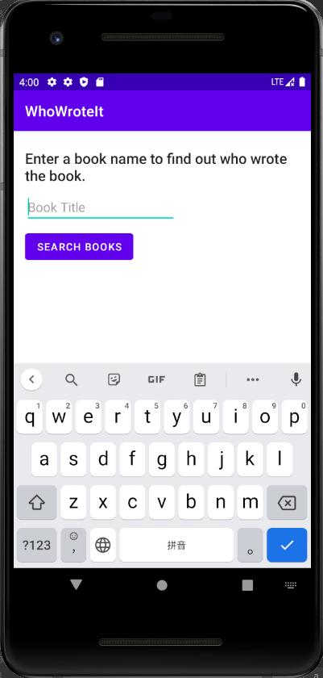

# Lab9 - Practice - Who Write It

- [Lab9 - Practice - Who Write It](#lab9---practice---who-write-it)
  - [Screenshot](#screenshot)
    - [Program ScreenShot](#program-screenshot)
    - [Layout ScreenShot](#layout-screenshot)
    - [Runtime ScreenShot](#runtime-screenshot)
  - [Video](#video)
  - [Code](#code)
    - [MainActivity.java](#mainactivityjava)
    - [FetchBook.java](#fetchbookjava)
    - [NetworkUtils.java](#networkutilsjava)
    - [activity_main.xml](#activity_mainxml)
    - [string.xml](#stringxml)
    - [color.xml](#colorxml)
## Screenshot
### Program ScreenShot
- 

### Layout ScreenShot

- 


### Runtime ScreenShot
- 

- 

 

## Video
[视频链接](../../assets/Lab9/practice/lab9_practice.mp4)

## Code
### MainActivity.java
```java
package com.example.whowroteit;

import androidx.annotation.RequiresApi;
import androidx.appcompat.app.AppCompatActivity;

import android.content.Context;
import android.net.ConnectivityManager;
import android.net.NetworkInfo;
import android.net.Uri;
import android.os.AsyncTask;
import android.os.Build;
import android.os.Bundle;
import android.util.Log;
import android.view.View;
import android.view.inputmethod.InputMethodManager;
import android.widget.EditText;
import android.widget.TextView;

import java.net.MalformedURLException;
import java.net.URL;

public class MainActivity extends AppCompatActivity {
    private EditText mBookInput;
    private TextView mTitleText;
    private TextView mAuthorText;

    @Override
    protected void onCreate(Bundle savedInstanceState) {
        super.onCreate(savedInstanceState);
        setContentView(R.layout.activity_main);
        mBookInput = (EditText)findViewById(R.id.bookInput);
        mTitleText = (TextView)findViewById(R.id.titleText);
        mAuthorText = (TextView)findViewById(R.id.authorText);
    }

    @RequiresApi(api = Build.VERSION_CODES.M)
    public void searchBooks(View view) {
        String queryString = mBookInput.getText().toString();
        InputMethodManager inputManager = (InputMethodManager)
                getSystemService(Context.INPUT_METHOD_SERVICE);

        if (inputManager != null) {
            inputManager.hideSoftInputFromWindow(view.getWindowToken(),
                    InputMethodManager.HIDE_NOT_ALWAYS);
        }
        ConnectivityManager connMgr = (ConnectivityManager)
                getSystemService(Context.CONNECTIVITY_SERVICE);
        NetworkInfo networkInfo = null;
        if (connMgr != null) {
            networkInfo = connMgr.getActiveNetworkInfo();
        }

        if (networkInfo != null && networkInfo.isConnected()
                && queryString.length() != 0) {
            new FetchBook(mTitleText, mAuthorText).execute(queryString);
            mAuthorText.setText("");
            mTitleText.setText(R.string.loading);
        } else {
            if (queryString.length() == 0) {
                mAuthorText.setText("");
                mTitleText.setText(R.string.no_search_term);
            } else {
                mAuthorText.setText("");
                mTitleText.setText(R.string.no_network);
            }
        }
    }
}


```

### FetchBook.java
```java
package com.example.whowroteit;

import android.os.AsyncTask;
import android.util.Log;
import android.widget.TextView;

import org.json.JSONArray;
import org.json.JSONObject;

import java.lang.ref.WeakReference;

public class FetchBook extends AsyncTask<String, Void, String> {
    private WeakReference<TextView> mTitleText;
    private WeakReference<TextView> mAuthorText;
    private static final String LOG_TAG =
            NetworkUtils.class.getSimpleName();
    public FetchBook(TextView titleText, TextView authorText) {
        this.mTitleText = new WeakReference<>(titleText);
        this.mAuthorText = new WeakReference<>(authorText);
    }
    @Override
    protected String doInBackground(String... strings) {
        return NetworkUtils.getBookInfo(strings[0]);
    }

    @Override
    protected void onPostExecute(String s) {
        super.onPostExecute(s);
        try {
            // Convert the response into a JSON object.
            JSONObject jsonObject = new JSONObject(s);
            // Get the JSONArray of book items.
            JSONArray itemsArray = jsonObject.getJSONArray("data");

            // Initialize iterator and results fields.
            int i = 0;
            String des = null;
            String authors = null;
            // Look for results in the items array, exiting
            // when both the title and author
            // are found or when all items have been checked.
            while (i < itemsArray.length() &&
                    (authors == null && des == null)) {
                // Get the current item information.
                JSONObject item = itemsArray.getJSONObject(i);
                authors = item.getString("Author");
                des = item.getString("Desc");
                // Move to the next item.
                i++;
            }

            // If both are found, display the result.
            if (des != null && authors != null) {
                mTitleText.get().setText(authors);
                mAuthorText.get().setText(des);
                System.out.println(des);
            } else {
                // If none are found, update the UI to
                // show failed results.
                mTitleText.get().setText(R.string.no_results);
                mAuthorText.get().setText("");
            }

        } catch (Exception e) {
            // If onPostExecute does not receive a proper JSON string,
            // update the UI to show failed results.
            mTitleText.get().setText(R.string.no_results);
            mAuthorText.get().setText("");
        }
    }
}

```

### NetworkUtils.java
```java
package com.example.whowroteit;

import android.net.Uri;
import android.util.Log;

import java.io.BufferedReader;
import java.io.IOException;
import java.io.InputStream;
import java.io.InputStreamReader;
import java.net.HttpURLConnection;
import java.net.URL;

public class NetworkUtils {
    private static final String LOG_TAG =
            NetworkUtils.class.getSimpleName();
    // Base URL for Books API.
    private static final String BOOK_BASE_URL =  "https://sou.jiaston.com/search.aspx?";
    // Parameter for the search string.
    private static final String KEY = "key";
    // Parameter that limits search results.
    private static final String PAGE = "page";
    // Parameter to filter by print type.
    private static final String SITE_ID = "siteid";

    static String getBookInfo(String queryString){
        HttpURLConnection urlConnection = null;
        BufferedReader reader = null;
        String bookJSONString = null;
        try {
            Uri builtURI = Uri.parse(BOOK_BASE_URL).buildUpon()
                    .appendQueryParameter(KEY, queryString)
                    .appendQueryParameter(PAGE, "1")
                    .appendQueryParameter(SITE_ID, "app2")
                    .build();
            URL requestURL = new URL(builtURI.toString());
            urlConnection = (HttpURLConnection) requestURL.openConnection();
            urlConnection.setRequestMethod("GET");
            urlConnection.connect();
            // Get the InputStream.
            InputStream inputStream = urlConnection.getInputStream();

            // Create a buffered reader from that input stream.
            reader = new BufferedReader(new InputStreamReader(inputStream));
            // Use a StringBuilder to hold the incoming response.
            StringBuilder builder = new StringBuilder();
            String line;
            while ((line = reader.readLine()) != null) {
                builder.append(line);
                // Since it's JSON, adding a newline isn't necessary (it won't
                // affect parsing) but it does make debugging a *lot* easier
                // if you print out the completed buffer for debugging.
                builder.append("\n");
            }
            if (builder.length() == 0) {
                // Stream was empty. No point in parsing.
                return null;
            }
            bookJSONString = builder.toString();
        } catch (IOException e) {
            e.printStackTrace();
        } finally {
                if (urlConnection != null) {
                    urlConnection.disconnect();
                }
                if (reader != null) {
                    try {
                        reader.close();
                    } catch (IOException e) {
                        e.printStackTrace();
                    }
                }
        }
        return bookJSONString;
    }

}

```


### activity_main.xml
```xml
<?xml version="1.0" encoding="utf-8"?>
<ScrollView xmlns:android="http://schemas.android.com/apk/res/android"
    xmlns:app="http://schemas.android.com/apk/res-auto"
    xmlns:tools="http://schemas.android.com/tools"
    android:layout_width="match_parent"
    android:layout_height="fill_parent"
    android:layout_marginTop="8dp">

    <androidx.constraintlayout.widget.ConstraintLayout
        android:layout_width="match_parent"
        android:layout_height="wrap_content"
        android:layout_margin="16dp"
        tools:context=".MainActivity">


        <TextView
            android:id="@+id/instructions"
            style="@style/TextAppearance.AppCompat.Title"
            android:layout_width="0dp"
            android:layout_height="wrap_content"
            android:text="@string/instructions"
            app:layout_constraintStart_toStartOf="parent"
            app:layout_constraintTop_toTopOf="parent" />

        <EditText
            android:id="@+id/bookInput"
            android:layout_width="0dp"
            android:layout_height="wrap_content"
            android:layout_marginTop="8dp"
            android:ems="10"
            android:hint="@string/input_hint"
            android:inputType="text"
            app:layout_constraintStart_toStartOf="parent"
            app:layout_constraintTop_toBottomOf="@+id/instructions" />

        <Button
            android:id="@+id/searchButton"
            android:layout_width="wrap_content"
            android:layout_height="wrap_content"
            android:layout_marginTop="8dp"
            android:onClick="searchBooks"
            android:text="@string/button_text"
            app:layout_constraintStart_toStartOf="parent"
            app:layout_constraintTop_toBottomOf="@+id/bookInput" />

        <TextView
            android:id="@+id/titleText"
            style="@style/TextAppearance.AppCompat.Headline"
            android:layout_width="wrap_content"
            android:layout_height="wrap_content"
            android:layout_marginTop="16dp"
            app:layout_constraintStart_toStartOf="parent"
            app:layout_constraintTop_toBottomOf="@+id/searchButton" />


        <TextView
            android:id="@+id/authorText"
            style="@style/TextAppearance.AppCompat.Headline"
            android:layout_width="wrap_content"
            android:layout_height="wrap_content"
            android:layout_marginTop="8dp"
            android:layout_marginBottom="16dp"
            app:layout_constraintBottom_toBottomOf="parent"
            app:layout_constraintStart_toStartOf="parent"
            app:layout_constraintTop_toBottomOf="@+id/titleText" />

    </androidx.constraintlayout.widget.ConstraintLayout>
</ScrollView>
```

### string.xml
```xml
<resources>
    <string name="app_name">WhoWroteIt</string>
    <string name="instructions">Enter a book name to find out who wrote the book. </string>
    <string name="button_text">Search Books</string>
    <string name="input_hint">Book Title</string>
    <string name="no_results">"No Results Found"</string>
    <string name="authortext">authorText</string>
    <string name="loading">Loading...</string>
    <string name="no_search_term">Please enter a search term</string>
    <string name="no_network">Please check your network connection and try again.</string>
</resources>
```

### color.xml
```xml
<?xml version="1.0" encoding="utf-8"?>
<resources>
    <color name="purple_200">#FFBB86FC</color>
    <color name="purple_500">#FF6200EE</color>
    <color name="purple_700">#FF3700B3</color>
    <color name="teal_200">#FF03DAC5</color>
    <color name="teal_700">#FF018786</color>
    <color name="black">#FF000000</color>
    <color name="white">#FFFFFFFF</color>
</resources>
```