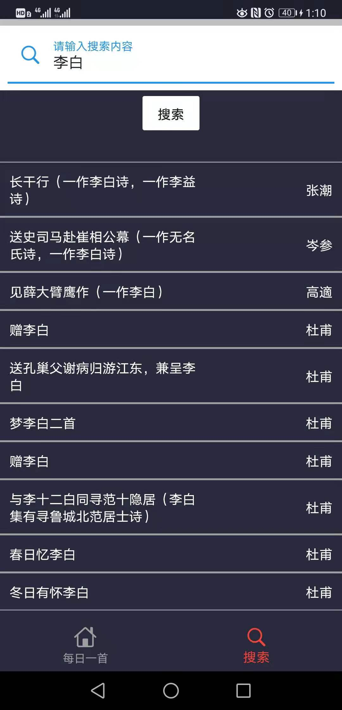

summary: 伴诗同行的codelab
id: 伴诗同行
categories: Android
tags: android
status: Published 
authors: codeman-cheng
Feedback Link: [codeman-cheng/IMD-Assignment (github.com)](https://github.com/codeman-cheng/IMD-Assignment/tree/master/伴诗同行)

<!-- 标题  用一级-->

# 伴诗同行 - codelab 

<!------------------- 步骤1 步骤用二级标签 --------------->

## 源码下载

<!-- 这一步估计需要的时间-->
Duration: 1 
<!-- 第一步的内容 start  -->

### 下载链接：

[codeman-cheng/IMD-Assignment (github.com)](https://github.com/lanliping/IMD/tree/master/Final)
<!-- 第一步的内容 end  -->

<!-------------------- 步骤 2------------------------>

## 开发环境配置

Duration: 2
<!-- 第二步的内容 start  -->

- 使用Flutter框架实现。
- 引入CupertinoIcons标准图标库以及其他相关库
- 采用一言API实现数据的获取。

<!-- 第二步的内容 end  -->

<!-------------------- 步骤 3------------------------>

## 运行环境配置

Duration: 3
<!-- 第三步的内容 start  -->

Android系统可正常下载apk文件，也生成了支持谷歌商城的apkbundle文件。

<!-- 第三步的内容 end  -->

<!-------------------- 步骤 4------------------------>

## 运行效果展示

Duration: 4
<!-- 第四步的内容 start  -->

- 首先进入第一个页面，系统会根据当前地点以及时间、天气、季节等信息智能推荐一句符合情景的诗句，并在下方显示推荐原因。

- 点击右下角刷新按钮，可以刷新诗句。

  

- 其次，点击卡片可以使卡片旋转，背面显示诗句的完整内容，部分难懂的古诗也会附带一些简短的翻译。

  

- 第二个界面是搜索古诗界面，帮助用户检索想要鉴赏的古诗。

- 默认情况下会推荐图中几首古诗。

  

- 之后是输入关键词搜索功能，系统会根据用户输入的关键词自动检索相关内容，默认一次检索十个，当下拉到底部时，自动获取数据，直到数据获取完为止。
  

- 用户点击想要阅读的古诗条目，会自动进入一个新的界面，上面包含该古诗的完整内容

  

<!-- 第四步的内容 end  -->

<!-------------------- 步骤 3------------------------>

## 结束

